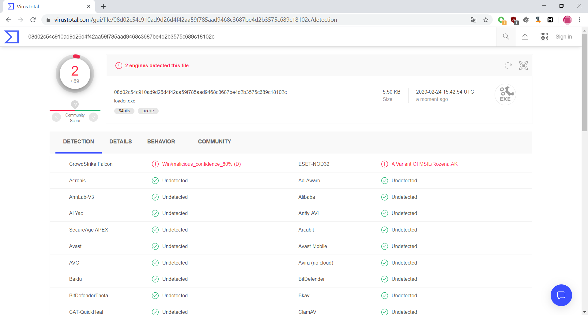

# shellcode loader
csharp 5632 byte xor 静态免杀,过Windows defender.

# 免杀效果

测试于 2020/2/24 23:30

http://r.virscan.org/language/zh-cn/report/5583273543afd24b387833e86c22a798 0/49

https://www.virustotal.com/gui/file/08d02c54c910ad9d26d4f42aa59f785aad9468c3687be4d2b3575c689c18102c/detection 2/69

# 使用方法

**注意不同位数的payload请使用相应的loader.**

1. enloader.exe 生成加密payload
2. cmd /c loader.exe payload